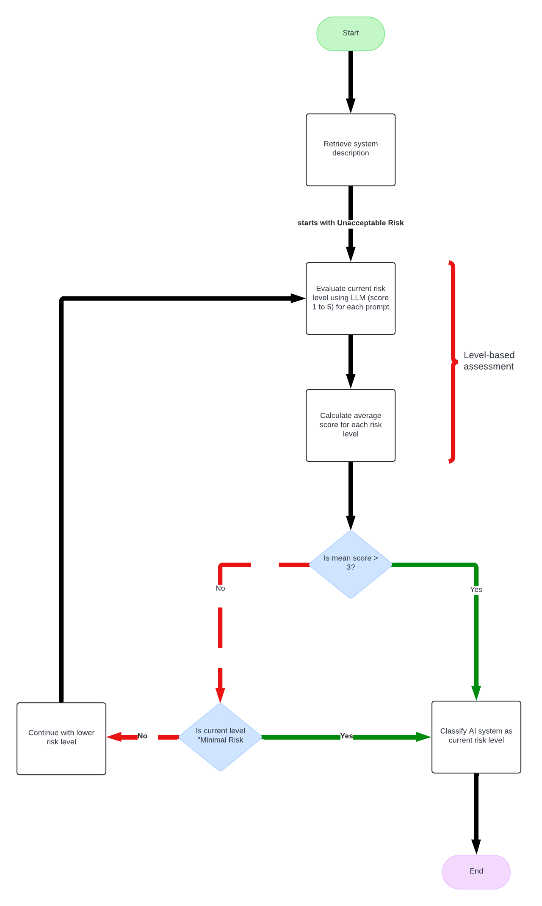

# EU AI Act Assessment

This project is designed to classify AI systems according to the **EU AI Act** using the **LLaMA 2 (7B)** model. The AI system is evaluated through several stages, including **Initial Risk Assessment**, **Level-Based Risk Assessment**, and **Risk Categorization**. The purpose is to ensure that AI systems comply with regulations and are categorized according to their risk levels.

## Table of Contents
- [Project Description](#project-description)
- [Features](#features)
- [Installation](#installation)
- [Usage](#usage)
- [AI Risk Assessment Workflow](#ai-risk-assessment-workflow)

## Project Description

This project evaluates AI systems to assess their compliance with the **EU AI Act**. The system follows a tree-based workflow, beginning with an **Initial Risk Assessment**. Based on the outcomes, it moves to **Level-Based Risk Assessment** or determines whether the AI system poses an **Unacceptable Risk**. The core components of the system include structured prompts designed for different phases of risk assessment and a fine-tuned **LLaMA 2** model to generate responses.

## Features
- **AI Risk Categorization** based on **EU AI Act** principles.
- **LLaMA 2 (7B)** model integration for automated risk assessments.
- **CSV-driven prompt system** for systematic AI evaluation.
- **Multi-step automated workflow**: Initial risk, level-based assessment, and ongoing monitoring.

## Installation

### Prerequisites

Ensure you have the following installed:
- Python 3.8+.
- Conda environment (optional but recommended).
- Hugging Face API Token (required to access the LLaMA 2 model).

### Clone the Repository
```bash
git clone https://github.com/nglinhbao/AI-EU-Act-Assessment.git
cd AI-EU-Act-Assessment
```

### Set Up Virtual Environment (Optional)
```bash
conda create --name AI-Act python=3.10
conda activate AI-Act
```

### Install Required Packages
```bash
pip install -r requirements.txt
```

### Authenticate Hugging Face
Ensure you have a Hugging Face token to access the LLaMA 2 model.

```bash
huggingface-cli login
```

Alternatively, you can export the token directly in your environment:
```bash
export HUGGINGFACEHUB_API_TOKEN="your_token_here"
```

## Usage

### Steps to Run the Assessment:

1. **Prepare the AI System Description**:
   - Create a `.csv` file containing the description of the AI systems that you wish to assess.
   - [Example](./sample.csv)

2. **Run the Assessment Script**:

   To start the AI system classification process, make sure you have the system description `.csv` file ready, and execute the following command:

   ```bash
   python3 main.py
   ```

3. **Prompts and AI System Evaluation**:
   - The system reads prompts from the `CSV` file (`ai_risk_prompts.csv`) and evaluates the AI system based on its description. 
   - If the AI system poses an **Unacceptable Risk**, the process halts and returns the result. Otherwise, it proceeds through all stages to classify the system as **High Risk**, **Limited Risk**, or **Minimal Risk**.

4. **Output**:
   - The system provides a risk categorization based on the predefined prompts in the CSV file.
   - Example outcomes include: **Unacceptable Risk**, **High Risk**, **Limited Risk**, or **Minimal Risk**.

### Example Output:

Here is an example of how the system would respond to various prompts:

```plaintext
(AI-Act) User:~/EU-AI-Act$ python3 main.py                                                                                                                                                                             
Loading checkpoint shards: 100%|███████████████████████████████████████████████████████████████████████████████████████████████████████████████████████████████████████████████████████████████| 2/2 [00:02<00:00,  1.50s/it]
Accuracy: 0.30
```

## AI Risk Assessment Workflow with Scoring System



The assessment follows these key stages, evaluated sequentially from top to bottom. Each prompt at every risk level is scored on a scale of **1 to 5**, where:
- **1** means the system absolutely does not meet the criteria,
- **5** means the system absolutely meets the criteria.

For each stage, if the **mean score** is greater than **3**, the system will be classified under that risk category.

### 1. **Unacceptable Risk**:
   - The system is first evaluated against prompts to identify if it violates fundamental human rights, Union values, or carries unacceptable risks.
   - Each prompt at this stage receives a score from **1 to 5**.
   - If the **mean score** of all prompts in this stage is greater than **3**, the system is classified as **Unacceptable Risk**, and the assessment halts. No further evaluation is carried out.

### 2. **High Risk**:
   - If the system passes the **Unacceptable Risk** stage, it is assessed for **High Risk** factors such as:
     - Impact on human life,
     - Handling of sensitive personal data,
     - Autonomous decision-making without human oversight.
   - Each prompt in this stage is scored from **1 to 5**.
   - If the **mean score** for the prompts in this stage is greater than **3**, the system is classified as **High Risk**, and further evaluation stops.

### 3. **Limited Risk**:
   - If the system does not qualify as **High Risk**, it is evaluated for **Limited Risk** factors like:
     - Bias detection mechanisms,
     - System transparency,
     - Fairness in decision-making processes.
   - Each prompt in this stage is scored from **1 to 5**.
   - If the **mean score** is greater than **3**, the system is classified as **Limited Risk**.

### 4. **Minimal Risk**:
   - If none of the previous stages result in a classification, the system is evaluated for **Minimal Risk**, including:
     - Proper handling of non-sensitive data,
     - Minimal impact on users and society,
     - Low potential for bias or unfair treatment.
   - Each prompt in this stage is scored from **1 to 5**.
   - If the **mean score** is greater than **3**, the system is classified as **Minimal Risk**.

---

### Example Workflow (Scoring):

1. **Unacceptable Risk Prompts**: Scores [5, 4, 2, 3]. 
   - Mean score = (5 + 4 + 2 + 3) / 4 = 3.5 → **Unacceptable Risk**.
   - Classification stops.

2. **High Risk Prompts**: Scores [2, 3, 4, 4]. 
   - Mean score = (2 + 3 + 4 + 4) / 4 = 3.25 → **High Risk**.
   
3. **Limited Risk Prompts**: Scores [2, 2, 3]. 
   - Mean score = (2 + 2 + 3) / 3 = 2.33 → Not classified as Limited Risk.
